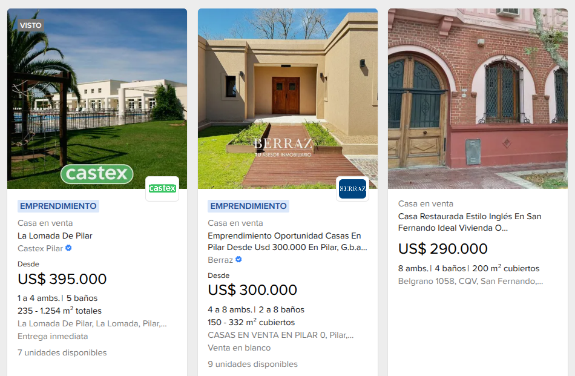

# ml-web-sraping

## Web scraper para extraer información de propiedades en venta en MercadoLibre Argentina



## Ejemplo de datos generados

El scraper genera un archivo CSV con la siguiente estructura:

| id  | price  | rooms | bathrooms | square_meters | zone                  | city  | price_per_m2 |
| --- | ------ | ----- | --------- | ------------- | --------------------- | ----- | ------------ |
| 1   | 90000  | 3     | 1         | 112           | Buenos Aires Interior | Lujan | 804          |
| 2   | 115000 | 4     | 3         | 170           | Buenos Aires Interior | Lujan | 676          |
| 3   | 148000 | 5     | 2         | 140           | Buenos Aires Interior | Lujan | 1057         |
| 4   | 160000 | 4     | 2         | 210           | Buenos Aires Interior | Lujan | 762          |
| 5   | 175000 | 4     | 3         | 900           | Buenos Aires Interior | Lujan | 194          |

## Estructura base

<pre>
ml-web-scraping/
├── images/
├── src/
│   ├── analysis/
│   ├── cleaning/
│   ├── processing/
│   ├── scraper/
│   ├── test/
│   └── main.py
├── data/
├── requirements.txt
└── README.md
</pre>

## Instalación y Ejecución

### Requisitos previos

- Python 3.8 o superior
- pip (gestor de paquetes de Python)

### Pasos para ejecutar localmente

1. **Clonar el repositorio**

```bash
git clone https://github.com/tachyon-lhc/ml-web-scraping.git
cd ml-web-scraping
```

2. **Crear un entorno virtual** (recomendado)

```bash
# En Windows
python -m venv venv
venv\Scripts\activate

# En Linux/Mac
python3 -m venv venv
source venv/bin/activate
```

3. **Instalar las dependencias**

```bash
pip install -r requirements.txt
```

4. **Ejecutar el scraper**

```bash
python src/main.py
```

5. Limpiar datos

```bash
python src/cleaning/clean.py
```

6. **Verificar los resultados**

Los datos scrapeados se guardarán en la carpeta `data/` en formato CSV.

### Configuración adicional (opcional)

Si necesitas configurar y aumentar la cantidad de paginas a scrapear, modifica en /src/scraper/config/config.py:

```python
PAGINAS_POR_CIUDAD=10
```

## 🛠️ Tecnologías utilizadas

- Python 3.x
- BeautifulSoup4 - Parsing HTML
- Requests - Peticiones HTTP
- Pandas - Manipulación de datos
